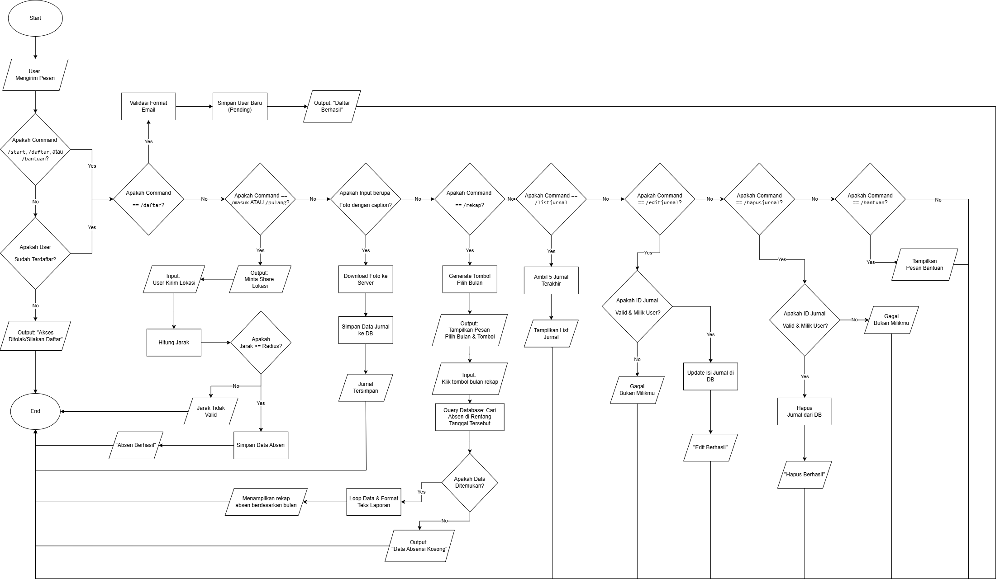
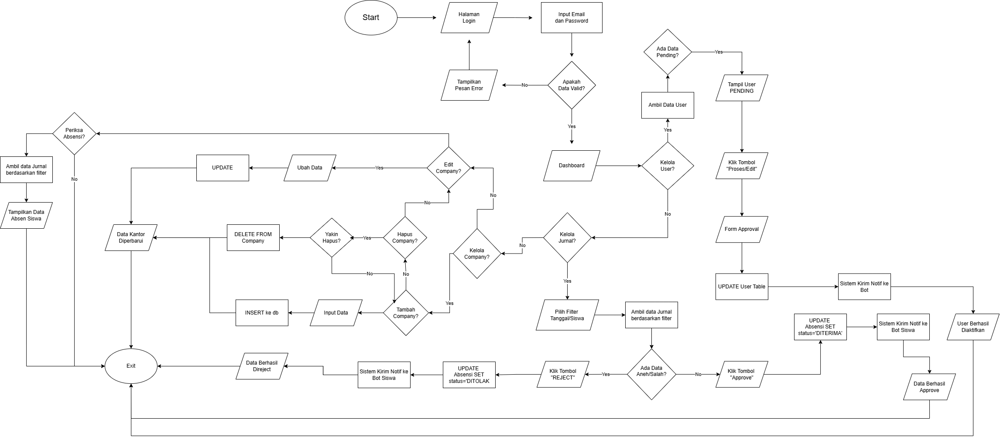

# 🤖 Skariga Absenku

<p align="center">
  
  <br>
  
  <br>
  <b>Sistem Absensi PKL Berbasis Geolocation & Bot Telegram</b>
  <br>
  <i>Project Kreativitas dan Inovasi (KIK) - SMK PGRI 3 Malang</i>
</p>

<p align="center">
  
  
  
  
  
</p>

---

## 📖 Tentang Project
**Skariga Absenku** adalah platform manajemen kehadiran dan jurnal harian otomatis untuk siswa PKL. Sistem ini menggunakan **Bot Telegram** sebagai antarmuka utama siswa untuk melakukan absensi berbasis lokasi (*geofencing*) dan pengisian jurnal, sementara **Web Dashboard** digunakan oleh admin/guru untuk monitoring dan rekap data.

### Fitur Utama:
- **📍 Smart Geofencing:** Validasi lokasi absen berdasarkan radius koordinat perusahaan.
- **🤖 Bot Telegram:** Fitur `check-in`, `check-out`, dan input jurnal harian langsung lewat Telegram.
- **📊 Admin Dashboard:** Manajemen data user, perusahaan, dan verifikasi akun pending.
- **📸 Bukti Jurnal:** Upload foto kegiatan sebagai bukti pengerjaan jurnal harian.
- **🖨️ PDF Reporting:** Ekspor rekapitulasi absensi ke format PDF secara otomatis.

---

## 🖼️ Dokumentasi Sistem

### 📐 Diagram & Alur
<p align="center">
  
  
</p>

<details>
<summary><b>Lihat Flowchart Sistem</b></summary>
<p align="center">
  <b>Flowchart User:</b><br>
  
  <br><br>
  <b>Flowchart Admin:</b><br>
  
</p>
</details>

### 📱 Antarmuka Bot Telegram (Result)
<p align="center">
  
  
</p>

### 💻 Dashboard Web (Result)
<p align="center">
  
  
</p>

---

## 🛠️ Tech Stack
- **Frontend:** Next.js 16 (App Router), React 19, Ant Design, Tailwind CSS v4
- **Backend & Bot:** Node.js, Telegraf API
- **ORM & Database:** Prisma dengan SQLite
- **Auth:** NextAuth.js

---

## 🚀 Cara Menjalankan Project

1. **Clone & Masuk ke Folder Source:**
   ```bash
   git clone [https://github.com/username/repo-name.git](https://github.com/username/repo-name.git)
   cd skariga-absenku
