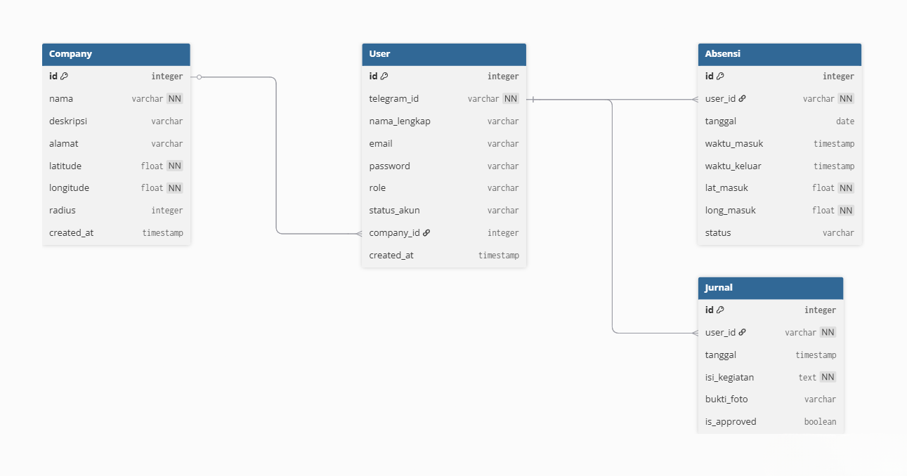
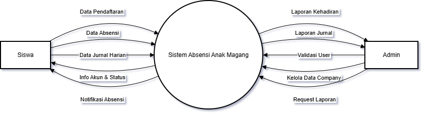

# 🤖 Skariga Absenku

<p align="center">
  
  &nbsp;&nbsp;&nbsp;&nbsp;
  
  <br>
  <br>
  <b>Sistem Absensi PKL Berbasis Geolocation & Bot Telegram</b>
  <br>
  <i>Project Kreativitas dan Inovasi (KIK) - SMK PGRI 3 Malang</i>
</p>

<p align="center">
  
  
  
  
</p>

---

## 📖 Tentang Project
**Skariga Absenku** adalah platform manajemen kehadiran dan jurnal harian otomatis untuk siswa PKL. Sistem ini menggunakan **Bot Telegram** sebagai antarmuka utama siswa untuk melakukan absensi berbasis lokasi (*geofencing*) dan pengisian jurnal, sementara **Web Dashboard** digunakan oleh admin untuk monitoring data.

### Fitur Utama:
- **📍 Smart Geofencing:** Validasi lokasi absen berdasarkan radius koordinat perusahaan.
- **🤖 Bot Telegram:** Fitur `check-in`, `check-out`, dan input jurnal langsung dari chat.
- **📊 Admin Dashboard:** Manajemen data user, perusahaan, dan verifikasi akun.
- **🖨️ PDF Reporting:** Ekspor rekapitulasi absensi ke format PDF otomatis.

---

## 🖼️ Dokumentasi Sistem

### 📐 Diagram Arsitektur
<p align="center">
  
  &nbsp;&nbsp;
  
</p>

### 📱 Preview Bot Telegram
<p align="center">
  
  &nbsp;&nbsp;
  
</p>

### 💻 Preview Dashboard Web
<p align="center">
  
  &nbsp;&nbsp;
  
</p>

---

## 🛠️ Tech Stack
- **Frontend:** Next.js 16, React 19, Ant Design, Tailwind CSS v4
- **Backend & Bot:** Node.js, Telegraf API
- **ORM & Database:** Prisma dengan SQLite

---

## 🚀 Panduan Instalasi (Langkah demi Langkah)

Ikuti langkah-langkah berikut untuk menjalankan project di komputer lokal kamu:

### 1. Persiapan Folder
Buka terminal dan masuk ke direktori source code utama:
```bash
cd skariga-absenku
