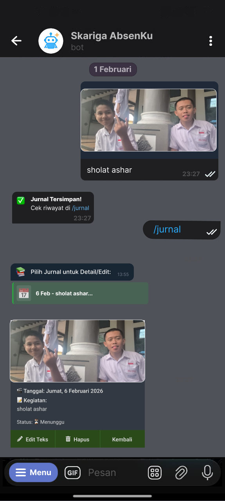

# 🤖 Skariga Absenku

<p align="center">
  
  &nbsp;&nbsp;&nbsp;&nbsp;&nbsp;&nbsp;&nbsp;&nbsp;&nbsp;&nbsp;
  
  <br><br>
  <b>Sistem Absensi PKL Berbasis Geolocation & Bot Telegram</b>
  <br>
  <i>Project Kreativitas dan Inovasi (KIK) - SMK PGRI 3 Malang</i>
</p>

<p align="center">
  
  
  
  
</p>

---

## 📖 Tentang Project
**Skariga Absenku** adalah platform manajemen kehadiran dan jurnal harian otomatis untuk siswa PKL. Sistem ini menggunakan **Bot Telegram** sebagai antarmuka utama siswa untuk melakukan absensi berbasis lokasi (*geofencing*) dan pengisian jurnal harian.

---

## 📐 Dokumentasi Arsitektur
<p align="center">
  <b>Entity Relationship Diagram (ERD) & Data Flow Diagram (DFD)</b><br>
  
  &nbsp;
  
</p>

---

## 📱 Preview Bot Telegram
<p align="center">
  
  &nbsp;
  
  &nbsp;
  
  &nbsp;
  
</p>
<p align="center"><i>(Tampilan Interaksi Siswa dengan Bot Absensi)</i></p>

---

## 💻 Preview Dashboard Web
<p align="center">
  
  &nbsp;
  
</p>
<p align="center">
  
  &nbsp;
  
</p>

---

## 🚀 Panduan Instalasi & Penggunaan

Ikuti langkah-langkah di bawah ini secara berurutan agar project berjalan lancar:

### 1. Masuk ke Folder Source Code
Buka terminal/CMD, lalu masuk ke folder utama aplikasi:
```bash
cd skariga-absenku
```

### 2. Instalasi Library
Jalankan perintah berikut untuk mengunduh semua dependensi (Next.js, Telegraf, Prisma, dll):
```bash
npm install
```

### 3. Konfigurasi File Environment
Buat file baru dengan nama `.env` di dalam folder `skariga-absenku`. Copy paste kode di bawah ini:
```env
DATABASE_URL="file:./prisma/dev.db"
TELEGRAM_BOT_TOKEN="MASUKKAN_TOKEN_BOT_DI_SINI"
NEXTAUTH_SECRET="buat_password_acak_bebas"
NEXTAUTH_URL="http://localhost:3000"
```

### 4. Sinkronisasi Database
Jalankan perintah ini untuk membuat struktur tabel database dan mengisi data awal (seeding):
```bash
npx prisma db push
npm run prisma db seed
```

### 5. Menjalankan Project
Gunakan perintah khusus ini untuk mengaktifkan **Web Dashboard** dan **Bot Telegram** sekaligus dalam satu jendela terminal:
```bash
npm run dev:all
```
* **Akses Web:** Buka `http://localhost:3000` di browser.
* **Akses Bot:** Buka Telegram, cari bot Anda, lalu ketik `/start`.

---
<p align="center">
  Developed by <b>Gilang Ardhi Maulana</b><br>
  Siswa RPL - SMK PGRI 3 Malang
</p>
